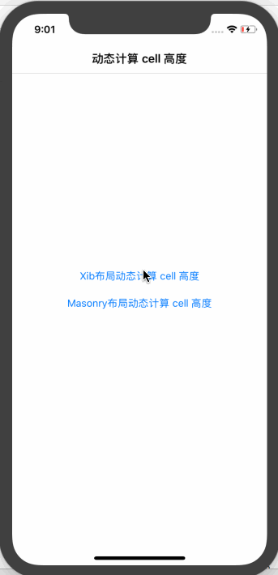

# cell 高度自动适应
1. 高度缓冲：

	``` Objective-C
	- (NSMutableDictionary *)cellHeightBuff
	{
	    if (!_cellHeightBuff)
	    {
	        _cellHeightBuff = [NSMutableDictionary dictionary];
	    }
	    return _cellHeightBuff;
	}
	```
2. 从缓存中取出高度：

	``` Objective-C
	- (CGFloat)tableView:(UITableView *)tableView estimatedHeightForRowAtIndexPath:(NSIndexPath *)indexPath
	{
	    NSNumber *height = [self.cellHeightBuff objectForKey:indexPath];
	    if(height)
	    {
	        return height.floatValue;
	    }
	    else
	    {
	        return 100;
	    }
	}
	```
3. 使用动态适应高度：

	``` Objective-C
	- (CGFloat)tableView:(UITableView *)tableView heightForRowAtIndexPath:(NSIndexPath *)indexPath
	{
	    return UITableViewAutomaticDimension;
	}
	```
4. 将高度缓存下来：

	``` Objective-C
	- (void)tableView:(UITableView *)tableView
  willDisplayCell:(UITableViewCell *)cell
forRowAtIndexPath:(NSIndexPath *)indexPath
	{
	    NSNumber *height = [NSNumber numberWithFloat:cell.frame.size.height];
	    
	    // 缓存 cell 高度
	    [self.cellHeightBuff setObject:height
	                            forKey:indexPath];
	}
	```
	
5. 效果

	