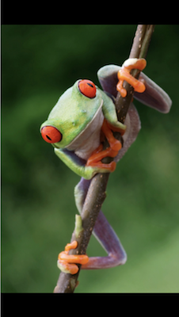
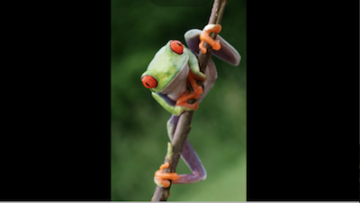
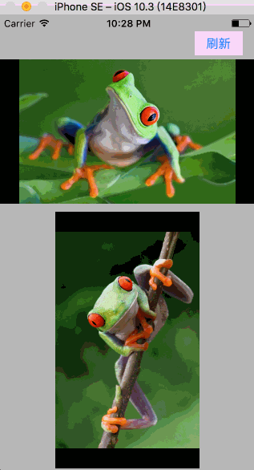

# 按比例缩放视图

> 在做视图展示是，为了保留原视图（如：视频、图片等）的比例不被改变，就必需把原始图进行 **等比例缩放**，以更好的展示。可以分为 4 种情况：


1. **横屏展示横屏视图：**

	
2. **竖屏展示竖屏视图：**

	
3. **横屏展示竖屏视图：**

	
4. **竖屏展示横屏视图：**
	
	

# 代码
``` Objective-C
/**
 等比例缩放子视图以适应父视图展示

 @param subSize 子视图原始 size
 @param parentSize 父视图原始 size
 @return 等比例缩放后 frame
 */
+ (CGRect)scaleWithSubSize:(CGSize)subSize
              inParentSize:(CGSize)parentSize
{
    CGRect resultRect = CGRectMake(0, 0, 0, 0);
    
    if (0 == subSize.width || 0 == subSize.height)
    {
        return resultRect;
    }
    CGFloat subDivisor = parentSize.width / parentSize.height;    // 子视图比例因子（宽/高）
    CGFloat parentDivisor = subSize.width / subSize.height;       // 父视图比例因子（宽/高）
    
    CGFloat resultH;
    CGFloat resultW;
    CGPoint originP;
    
    if (subDivisor > parentDivisor )        // 等高缩放
    {
        resultH = parentSize.height;
        resultW = resultH * parentDivisor;
    }
    else if ( subDivisor < parentDivisor)   // 等宽缩放
    {
        resultW = parentSize.width;
        resultH = resultW / parentDivisor;
    }
    
    else    // 等比例缩放
    {
        resultW = parentSize.width;
        resultH = parentSize.height;
    }
    // 起点位置
    originP.x  = (parentSize.width - resultW) / 2.0f;
    originP.y  = (parentSize.height - resultH) / 2.0f; ;
    resultRect = CGRectMake(originP.x, originP.y, resultW, resultH);
    
    return resultRect;
}
```

# 效果
